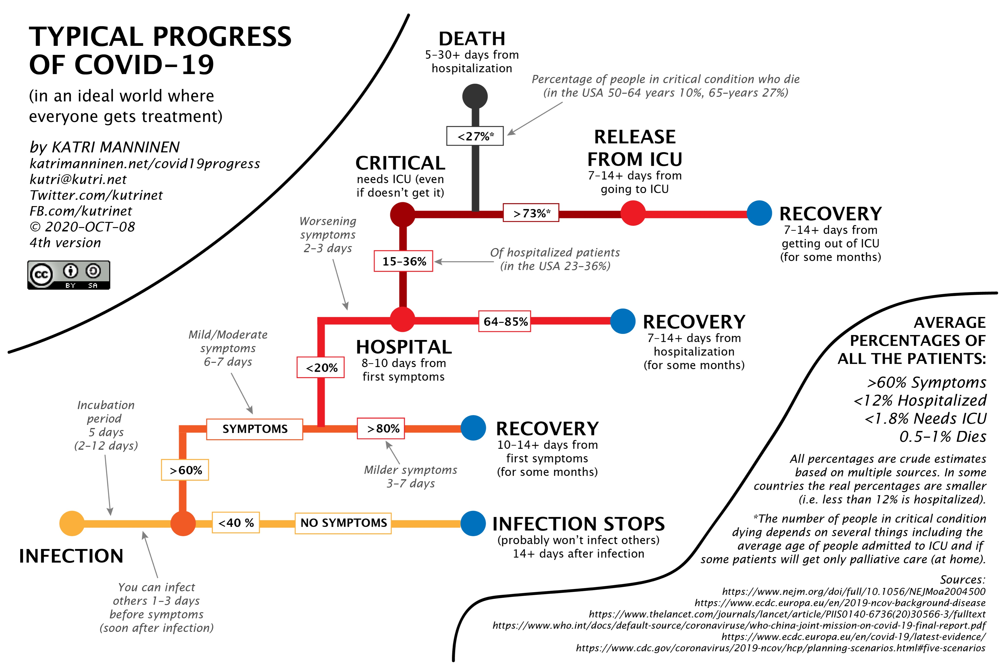

# Growth Demo

This application helps people understand the lag between a drop in people becoming infected, and their outcomes. 

It is based on work undertaken by Katri Manninen ( [Engish Twitter](https://twitter.com/katmanninen), [Finnish Twitter](https://twitter.com/kutrinet) ), in particular the diagram that she made demonstrating the typical progression of the disease.

This was the clearest demonstration I have ever seen of how the disease progresses, and why there is such a huge lag between infections, cases, hospitalisations, and deaths. 
The application I have built is based hugely on Katri's work. 

## Development
This is an angular application. You will need to have `angular/cli` installed globally.
1. Clone the project on your local machine
2. run `npm install`, 
3. `ng serve` to create a dev server. Navigate to `http://localhost:4200/`. 

The app will automatically reload if you change any of the source files.

## Disclaimers

* Please see the disclaimers in the html itself. There are many

## TODOs

* It would be nice if someone could tweak the numbers around each stage within their browser.

## Pull requests I would accept
* The application is very ugly. If you are willing to spend time making it look a bit neater, than please let me know.
* I would accept a pull request that increases the accuracy of the model, all things being equal. If you are willing to do that
work please let me know and understand the sources that you wish to use first of all. I will not accept a speculative PR on this.
* The way that the number of infections increase is pretty unsophisticated. Ideally it would take account of when people become at their
most infectious, rather than simply doubling every n days. 
* It is _not very good_ on mobile. While some of this will be due to the amount of data, I would accept PRs which improve the 
experience on mobile.

You can contact me on twitter to discuss these things. [@ryankilf](https://twitter.com/ryankilf).
